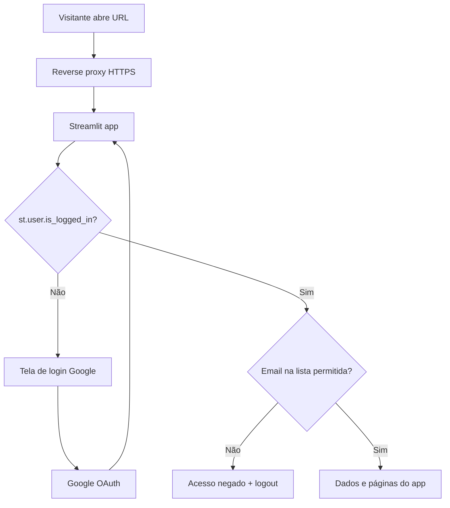

# Plano: Login Google + proteção de dados no VPS

> **Status:** pendente de implementação  
> **Criado em:** 2026-07-02  
> **Decisões:** login Google (OIDC nativo Streamlit) + allowlist de e-mails no `.env` + deploy em VPS com HTTPS

## Como executar este plano (no servidor ou outro PC)

1. **Leve o plano até o servidor** — `git pull` no repositório (após commit deste arquivo) ou copie `docs/PLANO_LOGIN_GOOGLE.md` manualmente.
2. **Abra o projeto no Cursor** na máquina do servidor.
3. **Peça ao agente para implementar**, por exemplo:
   > "Implemente o plano em `docs/PLANO_LOGIN_GOOGLE.md`"
4. **Configure manualmente** (não vai pro git):
   - Google Cloud OAuth (client ID/secret)
   - `.streamlit/secrets.toml` no servidor
   - `.env` com `GASTOMETRO_ALLOWED_EMAILS` e domínio real
5. **Suba com Docker** após a implementação do código.

### Checklist de tarefas

- [ ] Atualizar `streamlit>=1.42`, adicionar `Authlib`, `.gitignore` e `secrets.toml.example`
- [ ] Criar `app/auth.py` com allowlist, tela de login e `exigir_acesso()`
- [ ] Integrar gate em `app/streamlit_app.py` antes de bootstrap e navegação
- [ ] Desabilitar auth nos testes (`conftest`) + testes unitários de allowlist
- [ ] Montar `secrets.toml` no Docker e variáveis `GASTOMETRO_AUTH_*` no compose
- [ ] Adicionar reverse proxy HTTPS (Caddy) para deploy VPS sem expor 8501
- [ ] Documentar setup Google Cloud OAuth, allowlist e deploy VPS no README

---

## Contexto atual

O app é **Streamlit** ([`app/streamlit_app.py`](../app/streamlit_app.py)) sem nenhuma autenticação. Todas as páginas (Dashboard, Lançamentos, Faturas, etc.) carregam dados do SQLite assim que abrem. O Docker já expõe a porta `8501` ([`docker-compose.yml`](../docker-compose.yml)), mas **não há barreira de acesso** — qualquer pessoa com a URL vê dados financeiros.

O README já menciona OAuth no ngrok como opção de infraestrutura, mas isso não cobre VPS nem controle fino de quem acessa. A solução certa aqui é **auth no app** + **HTTPS no servidor**.

## Abordagem recomendada

Usar a **autenticação OIDC nativa do Streamlit** (`st.login` / `st.user` / `st.logout`), disponível desde **Streamlit 1.42**. O projeto hoje pede `streamlit>=1.39` — será necessário subir para `>=1.42` e adicionar `Authlib>=1.3.2` (dependência exigida pelo Streamlit para OAuth).



### Por que esta abordagem

| Opção | Prós | Contras |
|---|---|---|
| **Streamlit OIDC nativo** (escolhida) | Integra no código, funciona em VPS/ngrok/local, UX com botão Google | Precisa configurar Google Cloud + secrets |
| OAuth só no ngrok | Zero código | Não serve para VPS; sem allowlist no app |
| `streamlit-authenticator` | Simples | Senha manual, não é login Google |

## Arquitetura de segurança (3 camadas)

1. **Transporte** — VPS com domínio + HTTPS (Caddy ou nginx + Let's Encrypt). A porta `8501` **não** fica pública; só o proxy na 443.
2. **Autenticação** — Google valida identidade; Streamlit guarda sessão assinada com `cookie_secret`.
3. **Autorização** — Após login, checar `st.user.email` contra lista no `.env`. Se não estiver na lista: mensagem de acesso negado, botão de logout, `st.stop()` — **nenhuma query ao banco**.

## Mudanças no código

### 1. Novo módulo `app/auth.py`

Responsabilidades:

- `emails_permitidos()` — lê `GASTOMETRO_ALLOWED_EMAILS` (vírgula-separado, case-insensitive).
- `usuario_autorizado()` — `st.user.is_logged_in` **e** email na allowlist.
- `exigir_acesso()` — função central chamada no entrypoint:
  - Se auth desabilitada (`GASTOMETRO_AUTH_ENABLED=false`) → no-op (útil para testes/dev local).
  - Se não logado → tela mínima com botão **"Entrar com Google"** (`st.login`) + `st.stop()`.
  - Se logado mas não autorizado → `st.error("Acesso negado")` + logout + `st.stop()`.
  - Se autorizado → retorna (app segue).
- `renderizar_barra_usuario()` — na sidebar: nome/email + botão "Sair" (`st.logout`).

### 2. Gate no entrypoint `app/streamlit_app.py`

Ordem de execução:

```python
st.set_page_config(...)
exigir_acesso()          # bloqueia ANTES de bootstrap e navegação
_bootstrap_banco()
renderizar_barra_usuario()  # opcional na sidebar
nav = st.navigation(...)
nav.run()
```

Isso garante que **nenhuma página** renderiza dados sem passar pelo gate — não é preciso alterar cada arquivo em `app/paginas/`.

### 3. Dependências

Em `requirements.txt` e `pyproject.toml`:

```
streamlit>=1.42.0
Authlib>=1.3.2
```

### 4. Secrets do Streamlit (fora do git)

Criar `.streamlit/secrets.toml.example` (commitado) e `.streamlit/secrets.toml` (local, **não commitado**):

```toml
[auth]
redirect_uri = "https://SEU_DOMINIO/oauth2callback"
cookie_secret = "GERAR_STRING_ALEATORIA_FORTE"
client_id = "xxx.apps.googleusercontent.com"
client_secret = "xxx"
server_metadata_url = "https://accounts.google.com/.well-known/openid-configuration"
```

Adicionar ao `.gitignore`:

```
.streamlit/secrets.toml
```

### 5. Variáveis de ambiente

Expandir `.env.example`:

```bash
# Auth (produção no VPS)
GASTOMETRO_AUTH_ENABLED=true
GASTOMETRO_ALLOWED_EMAILS=voce@gmail.com,outro@gmail.com

# Para dev local sem login:
# GASTOMETRO_AUTH_ENABLED=false
```

No Docker, montar secrets como volume read-only:

```yaml
volumes:
  - ./.streamlit/secrets.toml:/app/.streamlit/secrets.toml:ro
```

E passar allowlist via `environment:` no compose.

## Configuração no Google Cloud (manual, uma vez)

1. Criar projeto em [Google Cloud Console](https://console.cloud.google.com/).
2. **APIs & Services → OAuth consent screen** — configurar app (nome "Gastômetro", email de suporte).
3. **Credentials → Create OAuth client ID → Web application**.
4. **Authorized redirect URIs** — adicionar **ambos** (dev + produção):
   - `http://localhost:8501/oauth2callback` (testes locais)
   - `https://SEU_DOMINIO/oauth2callback` (VPS)
5. Copiar `client_id` e `client_secret` para `secrets.toml`.
6. Gerar `cookie_secret` (string aleatória longa — ex. `openssl rand -hex 32`).
7. Modo **Testing** no Google: só e-mails de teste entram; para família pequena, basta cadastrar os e-mails da allowlist como test users. Quando estiver estável, publicar o app OAuth.

## Deploy no VPS

### Stack sugerida

```
Internet → Caddy (443/HTTPS) → gastometro:8501 (rede interna Docker)
```

Adicionar serviço `caddy` ao `docker-compose.yml` (ou compose override `docker-compose.prod.yml`):

- Caddy com domínio real e certificado automático (Let's Encrypt).
- `gastometro` sem `ports: "8501:8501"` exposto publicamente — só `expose: 8501` na rede Docker.
- Manter bind mounts de `./dados`, `./entrada`, `./saida`.

Exemplo de `Caddyfile`:

```
gastometro.seudominio.com {
    reverse_proxy gastometro:8501
}
```

### Checklist pós-deploy

- [ ] `redirect_uri` em `secrets.toml` = `https://gastometro.seudominio.com/oauth2callback`
- [ ] Mesma URI cadastrada no Google Cloud
- [ ] `GASTOMETRO_AUTH_ENABLED=true`
- [ ] `GASTOMETRO_ALLOWED_EMAILS` com os e-mails da família
- [ ] `STREAMLIT_ENABLE_XSRF=false` e `STREAMLIT_ENABLE_CORS=false` atrás do proxy
- [ ] Firewall do VPS: liberar 80/443, **bloquear** 8501 externamente

## Testes

### Ajuste em `tests/conftest.py`

Fixture `autouse` que seta:

```python
monkeypatch.setenv("GASTOMETRO_AUTH_ENABLED", "false")
```

Assim os testes existentes em `tests/test_app_streamlit.py` continuam passando sem mock de OAuth.

### Novos testes em `tests/test_auth.py`

Testes unitários puros (sem Streamlit runtime):

- `emails_permitidos()` parseia lista, ignora espaços, case-insensitive.
- `email_autorizado("voce@gmail.com")` com allowlist configurada.
- Com auth desabilitada, `exigir_acesso` não bloqueia (mock leve).

## Documentação

Atualizar seção de deploy no `README.md`:

- Passo a passo Google Cloud OAuth.
- Como gerar `secrets.toml` e allowlist.
- Deploy VPS com Caddy.
- Aviso: **nunca** commitar `secrets.toml`, PDFs ou `.env`.

## O que fica de fora (escopo consciente)

- **Multi-tenant** (cada usuário com banco separado) — o app é familiar, banco único; allowlist resolve.
- **Autorização por papel** (admin vs leitor) — não pedido agora.
- **2FA extra** — Google já oferece; suficiente para uso familiar.

## Ordem de implementação

1. Bump de deps + `.gitignore` + `.env.example` + `secrets.toml.example`
2. `app/auth.py` + gate em `streamlit_app.py`
3. Testes (`conftest` + `test_auth.py`)
4. Docker: mount de secrets + variáveis de auth
5. Compose prod com Caddy (ou doc separada `DEPLOY.md` se preferir manter compose simples)
6. README com guia Google Cloud + VPS
